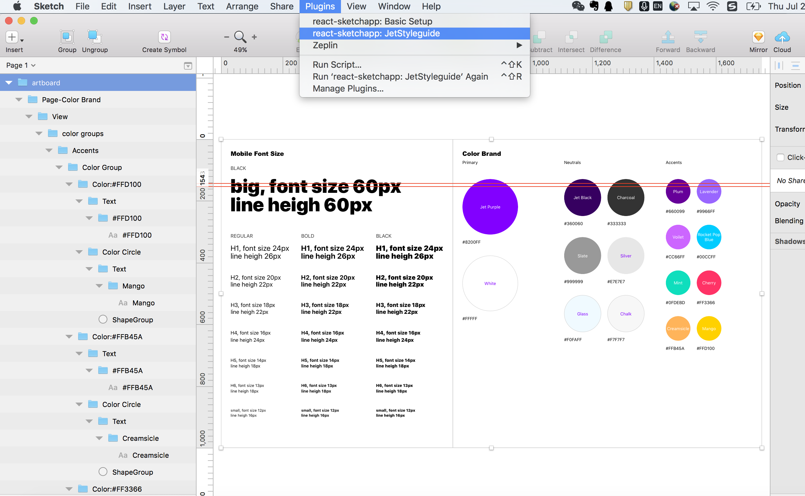

# react-sketchapp
sketch app styleguide

Install the dependencies
```
npm install
```

Run with live reloading in Sketch
```
npm run render
```

Or, to install as a Sketch plugin:
```
npm run build
npm run link-plugin
```
Then, open Sketch and navigate to `Plugins → react-sketchapp: JetStyleguide`

